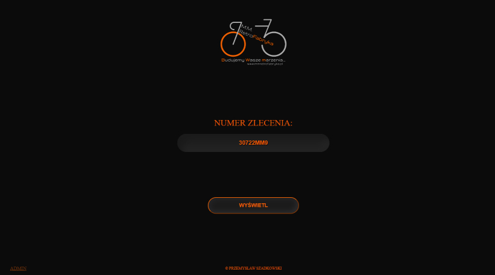
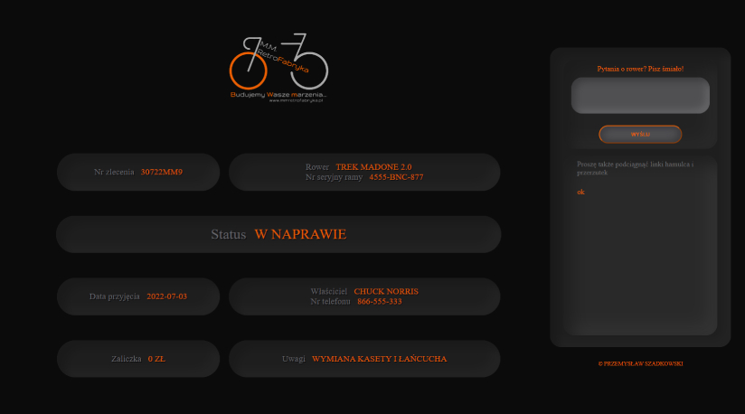
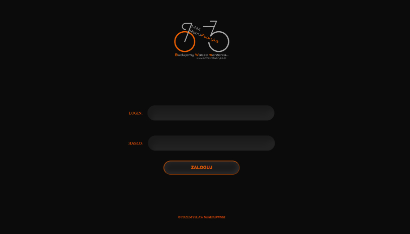
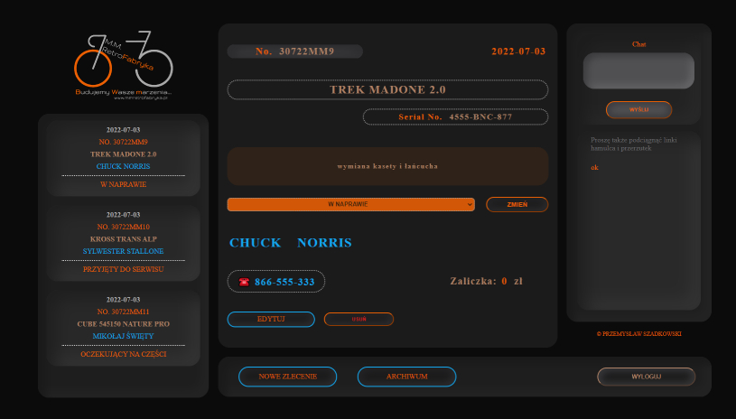
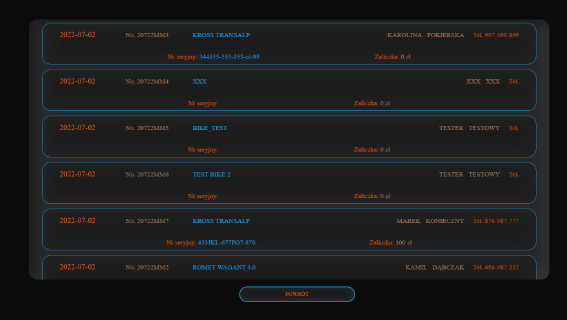
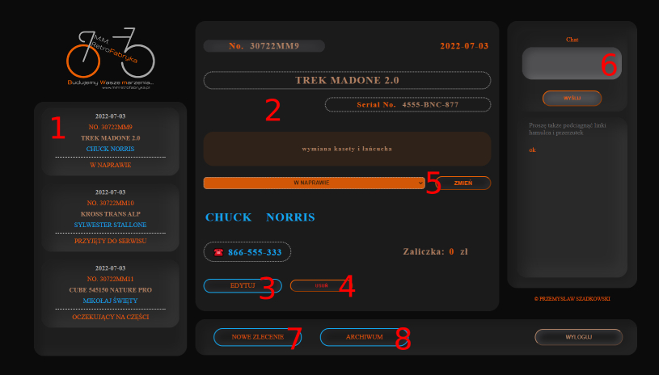
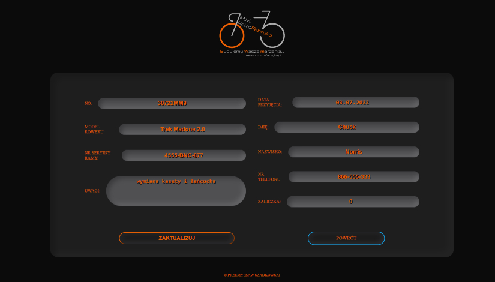
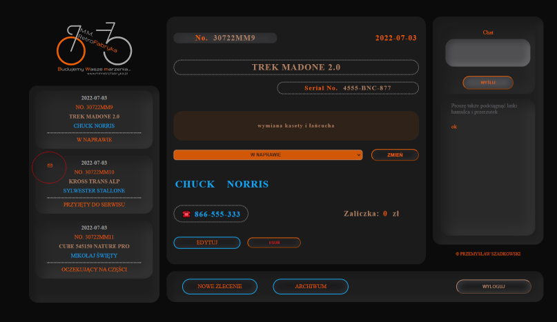

# Bike Garage

**The most important information:**

Live demo https://bikegarage.networkmanager.pl/

To see a client view -> type in the input "Numer zlecenia" one of the order's numbers:  
**30722MM9**,  
**30722MM11**  
or **30722MM12**.

To see an admin view -> click "Admin" link on the main page and log in:  
**login: admin**  
**password: test123**

This repository contains code of Bike Garage app - front-end.

Back-end code you can find here: https://github.com/Przemek-Szadkowski/BikeGarageBack

_The RetroFabryka website logo is the previous logo of a bicycle service owned by my friend, who gave his full consent to the use of this logo in my projects._

---

## Table of contents

- [Colors key](#colors-key)
- [General info](#general-info)
- [Screenshots](#screenshots)
- [Technologies](#technologies)
- [Features](#features)
- [Inspiration](#inspiration)
- [Contact](#contact)

## Colors-key

## General info

The Bike Garage app helps with manage bike repair service. It is a place to store all information related to orders and a tool to simplify contact with clients. This idea was born during visits to my friend's bicycle service - Retrofabryka. Mateusz runs one of the best bicycle services in central Poland (Łask city). He looks after each bike with heart and great knowledge - check google reviews! He has a lot of orders and contact with clients takes a lot of his time. So I came up with the idea to create an application that would simplify his contact with clients and help to control the constantly growing number of orders.

This is the first time that I have tried to create such an application. I started coding this application at the end of Mega Kurs, trying to use all my knowledge. After the information about the criteria for passing the course was announced, it turned out that I could submit it as a final project.

This is the first version of my app, so I have many ideas to improve it and fix bugs - look features subsection.

## Screenshots

Start view:

Client side view:

Admin login view:

Admin view:

Archive view:

## Technologies

- HTML
- CSS
- React
- MySQL
- Express.js

## Features

Admin View:

1. All orders that can be viewed in the scrolling list. After selecting an order, information about it appears in the field of the current order - no 2.
2. Information about current order.
3. Order edit button - displaying the edit window:

4. Delete order button - the order is removed from the list of orders and moved to the archive.
5. Order status - to select the current status from the drop-down list and its update after pressing the button "Zmień".
6. Chat window. It displays the sent messages between the client (client view) and admin (admin view). After sending a new message from the client, an envelope icon is displayed next to a given order on the list of orders. This icon disappears when you reply to the message and component will rerender - when you click on another order:

7. Order adding button - displaying the same window as when the edit window is visible.
8. Button displaying the archive with deleted orders.

### TODO LIST:

This is my first attempt to create any login system, so I am aware that this part is primarily for correction. Same as RWD, which I didn't implement at all - I wanted to focus on the application.

- RWD,
- authorization and authentication,
- search bars for admin to filter current orders and archive,
- add email or sms info for client, when bike is ready to collect,
- authorization for clients (password needed to log in, not only order number),
- rerender orders list when admin is sending back message to client (turn off new message icon).

## Status

Project is: \_in progress

## Inspiration

Project inspired by my friend Mateusz - owner of bike service RetroFarbyka in Łask city.

## Contact

Created by [przemoszadkowski@o2.pl](mailto:przemoszadkowski@o2.pl) - feel free to contact me!
